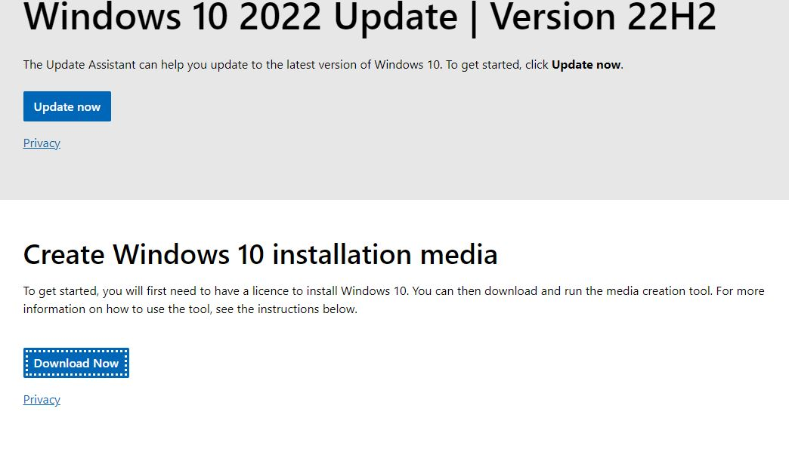
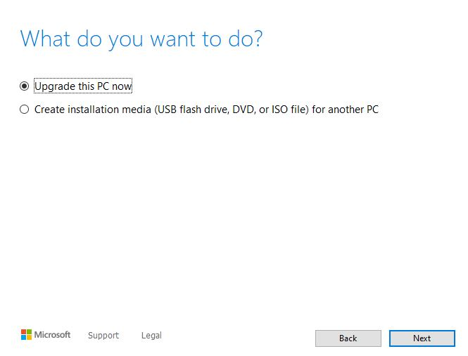

<h1>JBloom - Setting Up a Virtual Machine</h1>

<h2>Description</h2>
In this short guide I will walk you through the process of creating a virtual Machine using Virtual box that you can use to safely run tests.
<br />


<h2>Step 1: Install VirtualBox.</h2>


<b>The first thing you need to do is install the proper program. Head over to virtualBox's website and click the download button as depicted below. Make sure you download the version that matches your operating system. In my case I am using a windows machine. You can download it here: [VirtualBox](https://www.virtualbox.org/) </b>


 
 <h2>Step 2: Download an iso</h2>
 
 <b>You will need an iso file to create the machine. you can create your own if you have a valid windows license but to keep things simple we will download one from microsoft. Using the link below you will need to click the "download now" button. You can download this here: [Windows Iso](https://www.microsoft.com/en-ca/software-download/windows10))</b>



 <b>Once downloaded you will need to run the file and using the microsoft setup tool hit accept.<b>
  
 

<b>following that you will need to select the "create installation media" button and hit next.<b>



<b>On the next page we will just use the reccomended settings to keep things simple.<b>


<b>On this last page we will select the iso file button and save it somewhere that we can locate it later.<b>


 <h2>Step 3: Creating the Machine</h2>
 <b>When VirtualBox is opened you should be greeted with a page similar to the onle seen below. You can see I already have a few machines created. To create a new machine simply hit the new button.<b/>

 

 <b>Next Name the machine whatever you want to call it and make sure to select the iso that you downloaded. I forgot to select it for this picture but I chose to skip unattended installation.<b>

 

<b>Click the hardware dropdown and set the specifications you would like for your machine and then click the finish button.<b>


<b>Once all of that is finished you should see the machine added to VirtualBox's home screen.<b>


<h2>Conclusion</h2>

<b>Congratulations! you have set up your first virtual machine! That wraps things up. Hope you enjoyed.</b>

</p>

<!--
 ```diff
- text in red
+ text in green
! text in orange
# text in gray
@@ text in purple (and bold)@@
```
--!># Virtual_Sandbox_Setup
